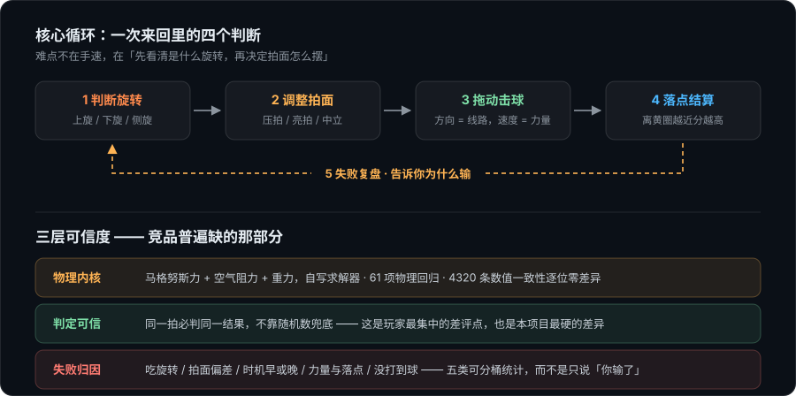
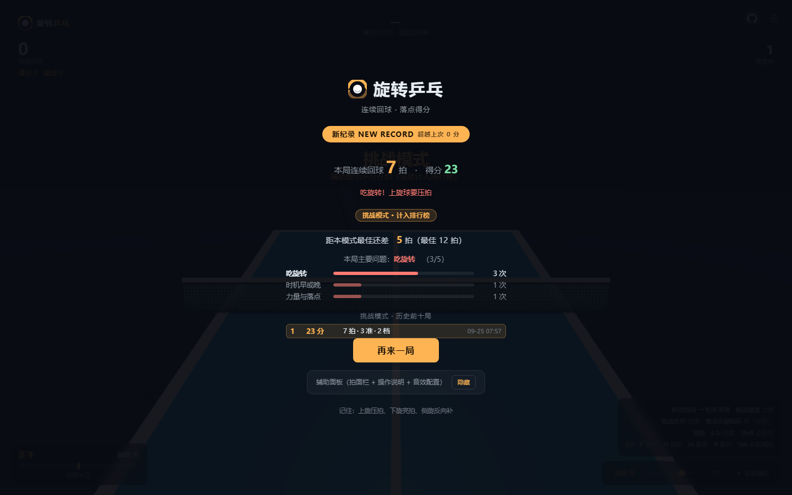
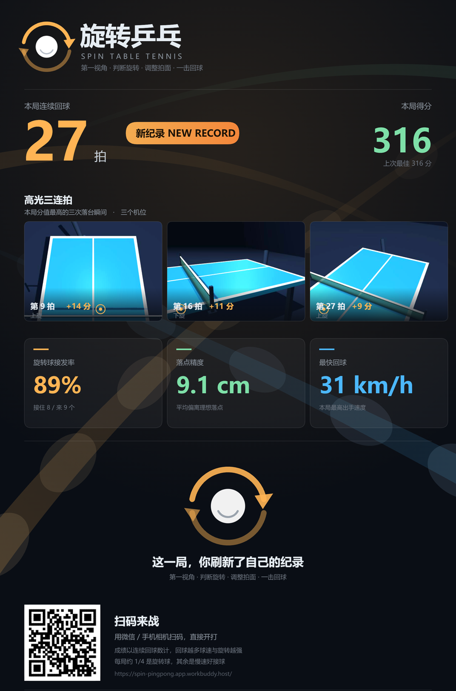
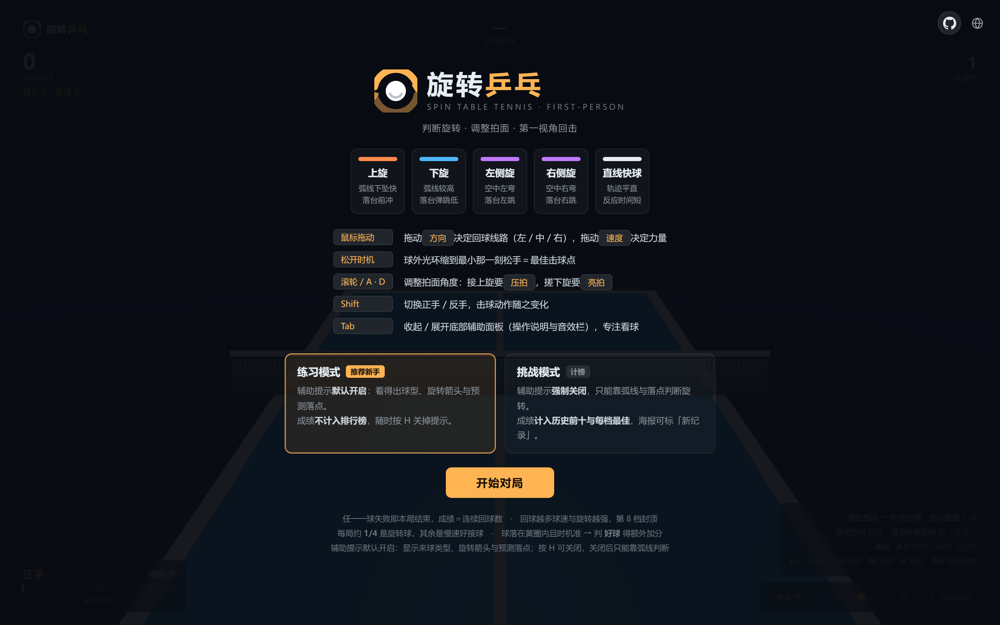
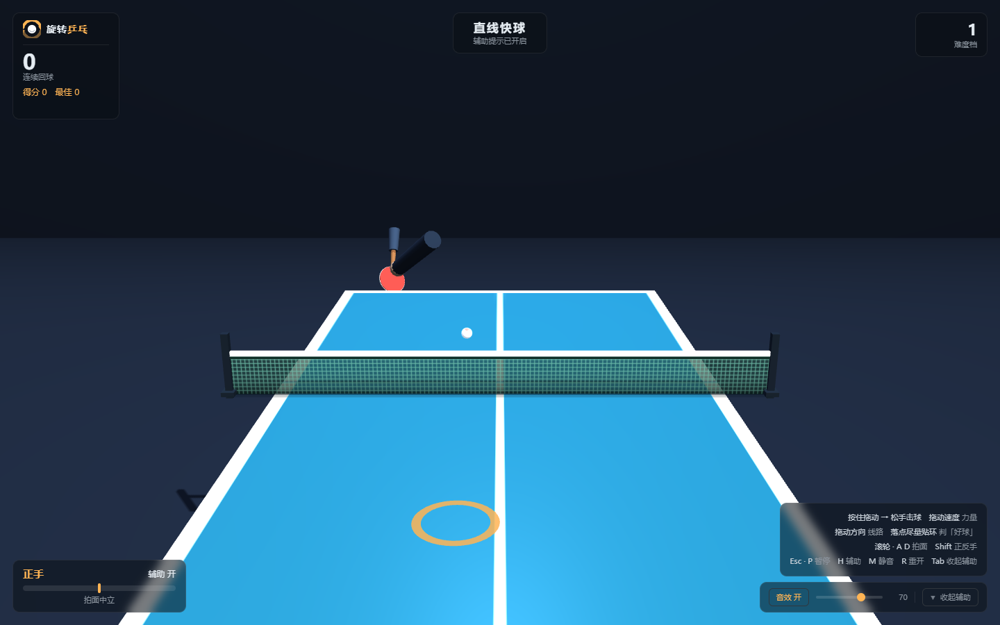
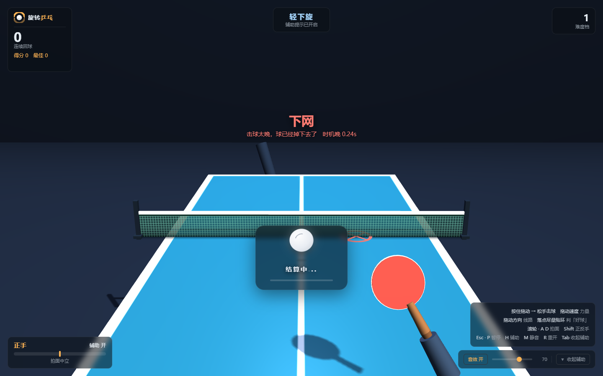
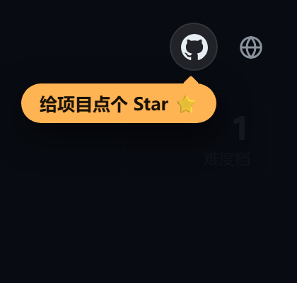

<div align="center">

# 旋转乒乓 · Spin Table Tennis

**PC 端第一视角 3D 乒乓球反应小游戏**

难点不在手速，在**看清旋转**：上旋要压拍、下旋要亮拍、侧旋得反向补 —— 判断错了，球直接飞出去。

打开浏览器就能玩：**不用下载、不用注册、不联网也能跑**（Three.js 已内置在仓库里）。

[**▶ 在线试玩**](https://spin-pingpong.app.workbuddy.host/)　·　[技术文档](docs/TECHNICAL.md)　·　[玩法规则](#玩法规则)　·　[快捷键](#快捷键)

</div>

---



---

## 这是什么

一个**单人、短局、以旋转辨识为技巧点**的乒乓球小游戏。

和多数乒乓球游戏不同，它不靠「谁点得快」定胜负 —— 每一拍你都要先做一次判断：

| 来球 | 你要做的 | 做错了会怎样 |
|---|---|---|
| **上旋** | 压拍（拍面前倾） | 不压就飞出台 |
| **下旋** | 亮拍（拍面后仰，搓回去） | 不亮就下网 |
| **侧旋** | 拍面中立 + 反向补偿线路 | 不补就拐出边线 |
| **直线快球** | 中立拍面、稳住时机 | 反应时间最短 |

**一球失误即本局结束**，成绩＝连续回球数。回球越多，球速与旋转越强，第 8 档封顶。

---

## 两种模式

第一次打开会让你二选一 —— 这两个模式的差异**只有一处**：辅助提示。

|  | **练习模式** | **挑战模式** |
|---|---|---|
| 辅助提示 | 默认开启（按 `H` 可关） | **强制关闭** |
| 看得到什么 | 来球类型、旋转箭头、预测落点圈、击球点标记 | 只能靠弧线和落点自己判断 |
| 成绩 | 不计入排行榜 | **计入历史前十与每档最佳** |
| 分享海报 | 不标「新纪录」 | 破纪录可标 |

> **为什么不直接降低难度来照顾新手？**
> 因为那会侵蚀「旋转辨识」这个核心价值 —— 产品会退化成一个无脑乒乓。
> 更好的做法是给新手一条低门槛路径（练习模式），但**不改变高门槛路径的标准**（挑战模式计榜）。

---

## 打完一局，你会看到什么

失败之后不只有一句「你输了」，而是**告诉你输在哪、离最佳还差多少**：

<div align="center">



</div>

三块信息各有各的用处：

- **本局失败构成** —— 把你反复栽的那一类挑出来（例：「本局主要问题：吃旋转 3/5」）。
  知道自己错在哪，比知道错了更有用。
- **距本模式最佳还差 N 拍** —— 把「我有没有进步」变成一个具体数字。
- **挑战模式历史前十** —— 跨 10 局的目标，而不是只在单局里爽一下。

---

## 为什么又做一个乒乓球游戏

开工前横向调研了 14 款竞品（移动端 / VR / 主机 / 网页 / 微信小游戏，覆盖四个圈层）。
把它们的玩家差评交叉比对后，发现**最集中的差评不是「不好玩」，而是「判定不可信」**：

| 竞品 | 玩家原声 |
|---|---|
| Virtual Table Tennis | 「球拍碰到了球却打不动」「擦边球判定玄学」（评分被拖到 3.90／18 万评价） |
| Ping Pong Fury | 「没做加旋动作也出旋」 |
| King of Ping Pong: MEGAMIX | 「有些挥拍完全落空」（有输入延迟） |
| Lofi Ping Pong | 「漏一拍就失败，不知道自己错在哪」 |

所以这个项目把力气花在了三件竞品普遍不做的事上：

**1 · 物理内核自己写，判定不靠随机**

重力 + 空气阻力 + **马格努斯力**（旋转导致弧线偏移的那部分），自写求解器。
同一拍必判同一结果。<br>
配套 **61 项物理回归测试**与 **4320 条数值一致性校验（逐位零差异）** —— 改动物理参数时，历史行为不会悄悄变。

**2 · 失败原因分五类，可以统计**

不是笼统的「失误」，而是分成**吃旋转 / 拍面偏差 / 时机早或晚 / 力量与落点 / 没打到球**五桶，
在球真实落点的位置打红叉，并在结束页汇总成本局构成。

**3 · 零安装 + 一键进入的自传播链路**

零依赖（Three.js 内置，离线可跑）意味着「打开一个网址」就能玩。
成绩可生成**分享海报（含二维码）**，扫码直接进入游戏 —— 分享到开始不超过两步。

<div align="center">



<sub>分享海报：本局高光三连拍 + 旋转接球率／平均落点精度／最快回球三项指标 + 扫码即玩</sub>

</div>

---

## 截图

<div align="center">



<sub>开始页 —— 五种球型的弧线特征与应对方式，模式二选一在下方</sub>

<br><br>



<sub>第一视角对局 —— 左上读数、上方来球类型、左下拍面角度、右下按键表</sub>

<br><br>



<sub>击球瞬间 —— 球外光环缩到最小＝最佳击球点，黄圈＝理想落点</sub>

</div>

---

## 玩法规则

- **一球失误即本局结束**，成绩＝连续回球数，最佳纪录存在浏览器本地
- **来球池**：强旋转球（上旋／下旋／左／右侧旋）合计 25%，其余 75% 是慢速好接球
  （直线快球 45%、轻上旋 15%、轻下旋 15%）—— 轻上／下旋无论打到第几档都是「拍面中立就能接」的新手友好球
- **难度**：每 4 拍升一档，第 8 档封顶；到位时间基准 0.74s，每升一档减 0.03s
- **落点得分**：回球落点离黄圈越近越值钱（< 0.13m 判「落点精准」，< 0.065m 判「神来一板」），
  连续精准有滚雪球奖励 —— **所以「稳」比「猛」更值钱**，不会越打越急着加力
- **失败**后静置 1.25s 再弹结算页，让你看清失败原因、落点标注与偏差读数

---

## 快捷键

### 电脑（鼠标 + 键盘）

| 输入 | 作用 |
|---|---|
| **按住鼠标拖动 → 松手** | 松手即出拍。拖动**方向**定回球线路（左／中／右），拖动**速度**定力量 |
| **松手时机** | 球外光环缩到最小那一刻＝最佳击球点；越早弧线越高（出底线），越晚越容易下网 |
| **滚轮 / `A` · `D`** | 调整拍面角度：接**上旋压拍**、搓**下旋亮拍**、侧旋与直球用**中立**拍面 |
| **`Shift`** | 正手 / 反手（球拍从左侧 / 右侧入画，动作演出不同） |
| **`Esc` · `P`** | 暂停（来球飞行与计时一起挂起） |
| **`H`** | 辅助提示开关（**挑战模式下不可开启**，否则成绩失去可比性） |
| **`M`** | 静音 |
| **`R`** | 重开一局 |
| **`Tab`** | 收起 / 展开辅助面板（拍面栏 + 操作说明 + 音效配置） |

### 手机 / 平板（纯手势）

**横屏**游玩。触屏把原来的「左手键盘 / 右手鼠标」分工，原样搬到了左右两块屏幕区域：

| 手势 | 作用 |
|---|---|
| **屏幕右侧 55% 区域拖动 → 松手** | 等同鼠标拖动：方向定线路、速度定力量、松手时机定质量 |
| **屏幕左侧 45% 区域上下拖** | 等同滚轮 / `A` `D`：上拖亮拍、下拖压拍（辅助开启时由系统自动跟拍，无需手动） |
| **底部四个圆钮** | 暂停 ⏸ / 重开 ↻ / 辅助「辅」/ 正反手「正·反」，替代 `Esc` `R` `H` `Shift` |

**平板横屏可直接玩；手机竖屏会提示「请横屏」** —— 这不是偷懒。第一视角相机垂直视角固定 40°，
竖屏时水平视角只剩 **19.1°**，击球位置的可视范围宽度仅 **0.239m**，而球台半宽是 **0.7625m**：
球还没飞到能被看见的位置就已经出画了。横屏水平视角 **76.5°**，可视半宽 1.118m，球台完整入画。

---

## 运行

### 在线玩

<https://spin-pingpong.app.workbuddy.host/>

### 本地跑

**双击 `index.html`** 即可（推荐 Chrome / Edge / Firefox，需支持 WebGL）。

零依赖：Three.js 已内置在 `vendor/`，不联网、不装包、不需要构建步骤。
首次点击「开始对局」时会初始化音频（浏览器要求用户手势之后才能出声）。

> 想自己起服务：`python -m http.server 8000`，然后访问 `http://localhost:8000`。

### 跑测试

```bash
node _tools/_run_all.js          # 十一关本地回归
node _tools/_run_all.js --live   # 额外跑线上端到端验证
```

---

## 项目结构

```
index.html          # 页面骨架 + 全部样式（含 HUD / 结束页 / 海报浮层）
game.js             # 主逻辑：物理内核、渲染、输入、HUD、纪录系统
poster.js           # 分享海报绘制（含内联二维码矩阵、logo）
vendor/three.min.js # Three.js r149（内置，零依赖）
docs/
  TECHNICAL.md      # 技术文档：架构、设计取舍、踩坑记录、回归体系
  images/           # README 用图
_tools/             # 开发期测试脚本（不影响游戏运行）
```

游戏本体只有 **3 个文件**（`index.html` / `game.js` / `poster.js`）+ 一个 Three.js。

---

## 测试

这个项目的回归做得比较重 —— 因为物理和判定出问题极难靠肉眼发现。

`_tools/` 下共 **十三关**：

| 关卡 | 内容 |
|---|---|
| 语法 | 全部 JS/HTML 静态检查 |
| 物理内核 | 61 项断言（求解精度、能量守恒、旋转衰减…） |
| 数值一致性 | 4320 条轨迹逐位零差异比对 |
| 冒烟 | 桩化 DOM/THREE/WebAudio，6 局自动对局 + 200 次对打压测 + **71 项缺陷专项断言** |
| **移动端手势** | 53 项：视口/`touch-action` 四层/DOM 契约 + 双区手势分流 + 两套量纲 + 设备门控 + 竖屏几何 |
| 截图 | 真浏览器渲染，确认球拍入画且尺度合理 |
| 海报 | 15 项：抓帧非全黑、二维码逐模块回读、三机位取景、新纪录只在挑战模式 |
| 二维码 | 交叉验证 841/841 模块命中 |
| 布局 | 4 种窗口尺寸下量 `getBoundingClientRect` 两两求交，要求交面积为 0 |
| 声学 | 观众欢呼声频谱分析（共振峰合成） |
| 数值性能 | 求解耗时统计 |
| **真浏览器触摸** | 22 项：CDP 注入真实触摸，验零 `pointercancel`、触摸回球得分、竖屏引导层真拦截 |
| 线上 | 20 项线上产物端到端探针（含「抓帧期间主渲染器调用次数＝0」这类直接证据） |

---

## 贡献

欢迎提 Issue 与 PR。改动前建议先看一眼 [`docs/TECHNICAL.md`](docs/TECHNICAL.md) ——
里面记了架构约定、设计取舍和**已踩过的坑**，能省不少来回。两个硬约定：

1. **改物理或判定逻辑，必须跑 `_tools/_run_all.js`**，并保持数值一致性关卡全绿
2. **改 `index.html` 的样式后必须重新部署再跑线上验证** —— CDN 有概率继续返回旧 HTML

### 顺手点个 Star

游戏页面右上角就放着这个入口 —— 觉得有意思的话，帮忙点一下：

<div align="center">

</div>

---

## License

[MIT](LICENSE) © 2026 卢克先生
